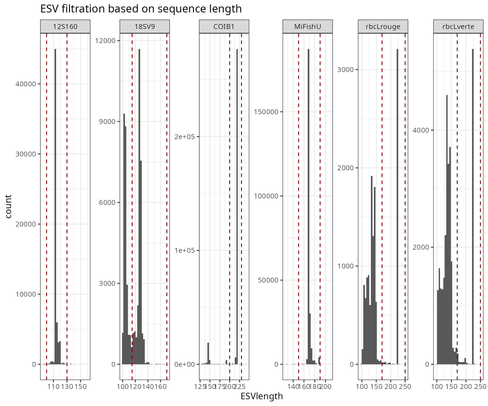

```{r setup, include=FALSE}
knitr::opts_chunk$set(echo = TRUE,
                      dev = "png",
                      dpi = 150)
knitr::opts_knit$set(root.dir = here::here())

# Données initiales
source(file.path(here::here(), "01_Code", "Functions", "get.value.R"))
library(tidyverse)
library(ggforce)
library(kableExtra)

`%nin%` = Negate(`%in%`)

latex_escape <- function(str) {
  str <- gsub("\\\\", "\\\\textbackslash{}", str)
  str <- gsub("([_#$%&{}~^])", "\\\\\\1", str)
  str <- gsub("\n", " \\\\newline ", str)
  return(str)
}

# Variables à définir

projet <- c("Biodiversite_Parc_Marin") 
sequencer <- "Illumina NovaSeq PE150 1500M reads"

summary.msg <- latex_escape("Les résultats sont bons, seul un témoin négatif semble étrange, soit ADE_25_00711. Il est associé au site BER, est-ce possible qu'il y ait eu un échange avec l'un des échantillons?")

assign.final.path <- file.path(here::here(), "02_Results/03_TaxoAssign/Assignements.estuary.Final.csv")

LOCUS <- stringr::str_split(get.value("Loci", file = file.path(here::here(), "Options.txt")), pattern = ";")[[1]]
LOCUS <- c("12S160", "MiFishU", "COIB1")


SUBGROUP <- stringr::str_split(get.value("group.metabaR", file = file.path(here::here(), "Options.txt")), pattern = ";")[[1]]

data.info <- readr::read_csv(file.path(here::here(), "00_Data", "00_FileInfos", "SeqInfo.csv") )

data.info <- data.info %>% mutate(Sample_type = factor(Sample_type, levels = c("ECH", "POOL", "FNC", "SNC", "FNC_SNC", "SNC_FNC", "ENC", "PNC", "MNC", "PPC", "MPC", "MPC_High", "MPC_Low")))

data.info %>% group_by(ID_subproject, Loci) %>% 
  summarise(N = n()) %>% pivot_wider(names_from = Loci, values_from = N)

bioinfo.path <- getwd()

# Create a list of which PCR to be considered in each SUBGROUP

SUBGROUP.ls <- list()

for(x in SUBGROUP){
  
  subgroup <- c(data.info %>% dplyr::filter(ID_subproject == x) %>% pull(ID_subproject) %>% unique(),
                data.info %>% dplyr::filter(ID_subproject == x) %>% pull(ID_project) %>% unique(),                                                         
                "ALL", "All", "all") %>% unique()

  
      if(str_detect(x, "Twells_Innu_Nation" ) == T){
  
    subgroup <- c(subgroup, "Twells_Innu_Nation_NA") 
      
  }
  

  id <- data.info %>% dplyr::filter(ID_subproject %in% subgroup)  %>% pull(ID_sample) %>% unique()
  
  SUBGROUP.ls[[x]] <- id
  
  
}


```

<!-- Page titre -->
\clearpage
\thispagestyle{empty}
\centering
&nbsp;
\vfill
\huge Rapport d'analyses post-séquençage de librairies de métacodage à barres 

\Large 
*Metabarcoding libraries post-sequencing analysis report* 

\vfill
\Large Projet `r str_replace_all(projet, "_", " ")`

\vfill
\normalsize
Laboratoire de génomique

Institut Maurice-Lamontagne (IML) 

Pêches et Océans Canada

Mont-Joli, Canada

\vfill
Préparation des librairies | *Libraries preparation* : Jade Larivière, jade.lariviere@dfo-mpo.gc.ca

Analyses bioinformatiques | *Bioinformatic analysis* :  Audrey Bourret, audrey.bourret@dfo-mpo.gc.ca

Révision | *Revision* : Geneviève Parent, genevieve.parent@dfo-mpo.gc.ca

\vfill
`r Sys.Date()`

\raggedright


\newpage

\setcounter{tocdepth}{2}
\renewcommand*\contentsname{Table des matières}
*Table of content*
\tableofcontents 

\newpage

# 1. Objectif général du rapport | *Report general objective*

Ce rapport automatisé permet un survol qualitatif des données générées par le pipeline d’analyse en métacodage à barres  **[MLI_metabar_pipeline](https://github.com/GenomicsMLI-DFO/MLI_metabar_pipeline) (v.`r    get.value("MLI.version")`)** disponible sur Github. Plus spécifiquement, il fournis une description générale du jeu de données qui a été analysé et des étapes et des paramètres d'analyses dans le pipeline ainsiq qu'une vue d'ensemble des résultats préliminaires de détections d'ADNe avec l'objectif de guider les prochaines étapes du projet.

Les résultats présentés ne doivent en aucun cas être considérés comme finaux et ne peuvent être publiés tel quel. Ils devraient toujours être interprétés avec précaution.

----

*This automated report provides a qualitative overview of the data generated by the metabarcoding analysis pipeline* **[MLI_metabar_pipeline](https://github.com/GenomicsMLI-DFO/MLI_metabar_pipeline) (v.`r    get.value("MLI.version")`)** *available on Github. Specifically, it offers a general description of the analyzed dataset, the analysis steps and parameters used in the pipeline, as well as an overview of preliminary eDNA detection results, with the goal of guiding the next steps of the project.*

*The results presented here should not be considered final under any circumstances and cannot be published as such. They should always be interpreted with caution.*

&nbsp;

\begin{tcolorbox}[title=Observations relatives aux résultats, colback=white, colframe=gray, boxrule=0.5mm]

`r summary.msg`

\end{tcolorbox}

\newpage

# 2. Description du jeux de données | *Dataset description* 

```{r echo=FALSE}
n.samples.tot <- data.info %>% nrow()
n.loc.tot <- data.info %>% pull(Loci) %>% unique() %>% length() 

n.samples.projet <- data.info %>% filter(ID_sample %in% SUBGROUP.ls[[projet]], Loci %in% LOCUS) %>% pull(ID_sample) %>% length()
n.samples.ech <- data.info %>% filter(ID_sample %in% SUBGROUP.ls[[projet]], Sample_type %in% c("ECH", "POOL"), Loci %in% LOCUS) %>% pull(ID_sample) %>% length()
n.samples.control <- n.samples.projet - n.samples.ech 

```

Les données ont été séquencées sur une run de *`r sequencer`* comportant au total **`r n.samples.tot`** échantillons (pcr) et `r n.loc.tot` locus. Le projet **`r projet`** comprend un total de **`r n.samples.projet`** échantillons (pcr; incluant `r n.samples.control` contrôles), et **`r length(LOCUS)`** locus (**`r paste(LOCUS, collapse = ", ")`**). 

```{r message=FALSE, warning=FALSE, include=FALSE}
if(length(SUBGROUP) == 1){
   
  project.text.fr <- paste("Les échantillons de ce projet ont été analysés seuls (sans autres projets).")  
  project.text.en <- paste("The samples from this project were analyzed individually (without other projects).")   
}

if(length(SUBGROUP) == 2){
  
   project.text.fr <- paste("Les échantillons de ce projet ont été analysés avec 1 autre projet (",  paste(SUBGROUP %>% str_subset(projet, negate = T), collapse = ", "), ").") 
   project.text.en <- paste("The samples from this project were analyzed alongside 1 other project (",  paste(SUBGROUP %>% str_subset(projet, negate = T), collapse = ", "), ").") 
  
}  

if(length(SUBGROUP) > 1){
  
   project.text.fr <- paste("Les échantillons de ce projet ont été analysés avec", length(SUBGROUP) - 1,
                         "autres projets (",  paste(SUBGROUP %>% str_subset(projet, negate = T), collapse = ", "), ").") 

   project.text.en <- paste("The samples from this project were analyzed with", length(SUBGROUP) - 1,
                         "other projects (",  paste(SUBGROUP %>% str_subset(projet, negate = T), collapse = ", "), ").") 

     
}  
  
```

`r project.text.fr`

*The data were sequenced on a `r sequencer` run with a total of `r n.samples.tot` samples (PCR) and `r n.loc.tot` loci. The project `r projet` includes a total of `r n.samples.projet` samples (PCR; including `r n.samples.control` controls) and `r length(LOCUS)` loci (`r paste(LOCUS, collapse = ", ")`).*

*`r project.text.en`*


```{r echo=FALSE, message=FALSE, warning=FALSE}

summary.1 <- data.info %>% filter(ID_sample %in% SUBGROUP.ls[[projet]],
                     Loci %in% LOCUS) %>% 
              group_by(Loci, Sample_type) %>% 
              summarise(N = n()) %>% 
               pivot_wider(names_from = Sample_type, values_from = N)


summary.1  %>% ungroup() %>% mutate(Total = select(. , -1) %>% rowSums()) %>% 
              knitr::kable(caption = "Nombre d'échantillons (pcrs) par locus et catégorie.\n*N samples (pcrs) by loci and category.*")


```

Accronymes utilisés pour décrire les échantillons | *Accronyms used to describe samples *

ECH/POOL = Échantillon | *Sample*

SNC = Contrôle négatif de terrain | *Sampling negative control*

FNC = Contrôle négatif de filtration | *Filtration negative control*

ENC = Contrôle négatif d'extraction | *Extraction negative control*

PNC/NTC/MNC = Contrôle negatif de PCR/metabarcoding | *PCR/metabarcoding negatif control*

PPC/MPC = Contrôle positif de PCR/metabarcoding | *PCR/metabarcoding positive control*

\newpage

# 3. Sommaire du pipeline d'analyse | *Analysis pipeline summary*

```{r nreads, echo=FALSE, message=FALSE, warning=FALSE}
# Load cutadapt summary

nreads.res <- readRDS(here::here("03_Rapport/99_Prepared", paste0("nreads_res_", projet, ".rds")))

# git project

git.url <- system2(command = "git", args = "remote get-url origin", stdout = T)

```

Le pipeline d'analyse se divise en huit grandes étapes qui ont une influence à la fois sur le nombre de reads (séquences) et le nombre de MOTUs (*Molecular operational taxnomique unit*, des OTUs, des ASVs, des ESVs ou autres) observé par échantillon. Dans le cas de ce rapport, les MOTUs sont des ESVs. Les grandes étapes sont :

1. Les données brutes (*Raw*)
2. Le retrait des adapteurs (*Adapt*)
3. La filtration sur la qualité (*Trim*)
4. La fusion des reads R1 et R2 (*Merge*)
5. La filtration sur la longueur des MOTUs (*ESVlength*)
6. Le retrait des chimères et la création d'une première table de MOTUs (*ESVdada2*)
7. La correction pour le tag-jumping (*ESVtagjump*)
8. La correction pour les contaminants, et le retrait des échantillon contrôle (*ESVfinal*)

Les scripts et résultats généraux se trouvent sur GitHub dans le répertoire **[`r git.url %>% str_remove("https://github.com/")`](`r git.url`)**. Tous les fichiers produits trop volumineux sont conservés sur nos serveurs (voir la liste complète des fichiers produits dans le **[Wiki du pipeline](https://github.com/GenomicsMLI-DFO/MLI_metabar_pipeline/wiki)**). Une description plus détaillée du pipeline utilisé est disponible à l'[Annexe I](#annexe-i).

----

*The analysis pipeline is divided into eigth main steps, each influencing both the number of reads (sequences) and the number of MOTUs (Molecular Operational Taxonomic Units: OTUs, ASVs, ESVs, or others) observed per sample. In the case of this report, MOTUs refer to ESVs. The main steps are:*

1. *Raw data (*Raw*)*
2. *Adapter removal (*Adapt*)*
3. *Quality filtering (*Trim*)*
4. *Merging of R1 and R2 reads (*Merge*)*
5. *Filtering basd on MOTUS length (*ESVlength*)*
6. *Chimera removal and creation of a first MOTU table (*ESVdada2*)*
7. *Correction for tag-jumping (*ESVtagjump*)*
8. *Correction for contaminants and removal of control samples (*ESVfinal*)*

*General scripts and results can be found on GitHub in the directory **[`r git.url %>% str_remove("https://github.com/")`](`r git.url`)**. All files that are too large are kept on our servers (the complete list of files produced can be found in the **[pipeline Wiki](https://github.com/GenomicsMLI-DFO/MLI_metabar_pipeline/wiki)**). A more detailed description of the pipeline used is available in Appendix I.*

\newpage

L'étape du retrait des adapteurs permet aussi de démultiplexer les échantillons par loci, puisque les même index sont souvent utilisés pour plus d'un loci. La valeur en N reads représente la profondeur de séquencage totale (incluant les témoins négatifs),  alors que le pourcentage, la proportion de chaque librairie par marqueur par rapport à la librairie complète (i.e., comprenant plusieurs marqueurs).

*The adapter removal step also allows for the demultiplexing of samples by loci, as the same indexes are often used for more than one locus. The value in N reads represents the total sequencing depth (including negative controls), while the percentage represents the proportion of each library by marker relative to the complete library (i.e., including multiple markers).*

```{r, echo=FALSE, message=FALSE, warning=FALSE, fig.height=4,  fig.width=7}

raw.tot.df <- nreads.res %>% filter(ID_sample %in% SUBGROUP.ls[[projet]],
                      Loci %in% LOCUS,
                      !is.na(ID_project),
                      Step %in% c("Raw")) %>% 
  group_by(Loci) %>% summarise(Ntot = sum(Nreads))

nreads.res %>% filter(ID_sample %in% SUBGROUP.ls[[projet]],
                      Loci %in% LOCUS,
                      !is.na(ID_project),
                      Step %in% c("Adapt")) %>%
  group_by(Loci) %>% summarise(Ncut = sum(Nreads)) %>% 
  left_join(raw.tot.df) %>% 
  mutate(Perc = round(Ncut/Ntot * 100, 1)) %>% 
  dplyr::select(Loci, "N reads" = Ncut, "% total" = Perc) %>%  knitr::kable(caption = "N reads séquencés par loci.\n*N reads sequenced by loci.*")


```


Le profil de variation en nombre de reads est différent selon l'étape du pipeline, le locus et le type d'échantillon (contrôle ou non).

*The variation profile in the number of reads differs depending on the pipeline step, the locus, and the sample type (control or non-control).*


```{r, echo=FALSE, message=FALSE, warning=FALSE, fig.height=4,  fig.width=7}

# Load post Metaba

nreads.res %>%  filter(ID_sample %in% SUBGROUP.ls[[projet]],
                      Loci %in% LOCUS,
                      !is.na(ID_project),
                      Step != "Raw") %>% 
  mutate(Cat_echantillon = ifelse(Sample_type %in% c("ECH", "POOL"), "Échantillon", "Contrôle")
        ) %>% 
  ggplot(aes(x = Step, y = Nreads1, col = Sample_type, group = ID_sample)) +
  #geom_jitter(height = 0) +
  geom_point(alpha = 0.5) +
  geom_line(alpha = 0.5) + 
  #geom_boxplot() +
  scale_y_continuous(trans="log10") +
  facet_grid(Cat_echantillon ~ Loci) +
    labs(y = "N reads + 1 (log)", x = "Étape du pipeline | Pipeline step", title = "Variation en N reads entre les étapes du pipeline",
         subtitle = "N reads variation between pipeline steps")+ 
  theme_bw(base_size = 8)+
  theme(legend.position = "bottom",
        axis.text.x = element_text(angle = 90, hjust = 1, vjust = 0.5))


```

Le patron variation en nombre de MOTUs est aussi différent selon l'étape du pipeline, le locus et le type d'échantillons (contrôle ou non). À noter que les MOTUs sont obtenus seulement à l'étape 4 lors de la fusion des reads R1 et R2.

*The variation pattern in the number of MOTUs also differs depending on the pipeline step, the locus, and the sample type (control or non-control). It should be noted that MOTUs are only obtained at step 4 during the merging of R1 and R2 reads.*


```{r nmotus, echo=FALSE, message=FALSE, warning=FALSE, fig.height=4, fig.width=7}
# Stats at the MOTUS level

nmotus.res <- readRDS(here::here("03_Rapport/99_Prepared", paste0("nmotus_res_", projet, ".rds")))


nmotus.res %>%  filter(ID_sample %in% SUBGROUP.ls[[projet]],
                      Loci %in% LOCUS,
                      !is.na(ID_project)) %>% 
    mutate(Cat_echantillon = ifelse(Sample_type %in% c("ECH"), "Échantillon", "Contrôle")
        ) %>% 
  ggplot(aes(x = Step, y = Nmotus1, col = Sample_type, group = ID_sample)) +
  #geom_jitter(height = 0) +
  geom_point(alpha = 0.5) +
  geom_line(alpha = 0.5) + 
  #geom_boxplot() +
 scale_y_continuous(trans="log10") +
  facet_grid(Cat_echantillon ~ Loci) +
    labs(y = "N motus + 1 (log)", x = "Étape du pipeline | Pipeline step", title = "Variation en N MOTUs entre les étapes du pipeline",
         subtitle = "N MOTUs variation between pipeline steps")+ 
  theme_bw(base_size = 8)+
  theme(legend.position = "bottom",
        axis.text.x = element_text(angle = 90, hjust = 1, vjust = 0.5))


```

\newpage

# 4. Assignations taxonomiques | *Taxonomic assignments*

```{r echo=FALSE, message=FALSE, warning=FALSE}

if(file.exists(assign.final.path)){
  
  assign.final.res <- read_csv(assign.final.path) %>% 
    dplyr::filter(Loci %in% LOCUS)
}


refseq <- assign.final.res$RefSeq %>% unique() %>% str_remove_all(".fasta")
method <- assign.final.res$Method %>% unique()
threshold <- assign.final.res$Threshold %>% unique()

# Message si tout a été fait avec blast NCBI
if( length(refseq) == 1 & all(refseq  == "nt")){

msg1.fr <- paste("Les assignations taxonomiques utilisées dans les sections suivantes, autant pour les corrections des tables d'ESV que les assignations taxonomiques présentées, ont été effectuées à l'aide d'une version interne de la banque de séquences publiques **NCBI-nt** (alias GenBank) et l'outil d'assignation **blastn** combiné à une approche de",  paste(method, threshold, collapse = " ou "), "%. Cette approche a été déterminée comme efficace au locus COI à partir d'un jeu de données du golfe Saint-Laurent. Toutefois, les résultats de ces analyses montrent aussi que les assignations à l'espèce sont de plus grande fiabilité lorsqu'une banque régionale de séquences références est utilisée.")  

msg1.en <- paste("The taxonomic assignments used in the following sections, both for the corrections of the ESV tables and the taxonomic assignments presented, were performed using an internal version of the public sequence database NCBI-nt (alias GenBank) and the **blastn** assignment tool combined with a", paste(method, threshold, collapse = " or "), "% approach. This approach was determined to be effective for the COI locus based on a dataset from the Gulf of St. Lawrence. However, the results of these analyses also show that species-level assignments are more reliable when a regional reference sequence database is used.")
  
}

# Message si tout a été fait avec un truc local
if(  length(refseq) == 1 & all(refseq  != "nt") ){

msg1.fr <- paste("Les assignations taxonomiques utilisées dans les sections suivantes, autant pour les corrections des tables d'ESV que les assignations taxonomiques présentées, ont été effectuées à l'aide de la **banque de séquences références locales,", refseq, "** et l'outil d'assignation **blastn** combiné à une approche de",  paste(method, threshold, collapse = ", "), "%. Bien que les banques locales peuvent être plus fiables que celles publiques, certaines précautions devraient être prises afin de s'assurer que des espèces importantes ne sont pas passées sous le radar.")  

msg1.en <- paste("The taxonomic assignments used in the following sections, both for the corrections of the ESV tables and the taxonomic assignments presented, were performed using the local reference sequence database", refseq,  "and the blastn assignment tool combined with a", paste(method, threshold, collapse = ", "), "% approach. While local databases can be more reliable than public ones, some precautions should be taken to ensure that important species are not overlooked.")

} 

# Message bonne combinaison publique et local 

if( length(refseq) > 1) {

msg1.fr <- paste("Les assignations taxonomiques utilisées dans les sections suivantes, autant pour les corrections des tables d'ESV que les assignations taxonomiques présentées, sont issues de séquences références locales provenant de", paste(refseq %>% str_subset(pattern = "nt", negate = T), collapse = ", "), "et l'outil d'assignation **blastn** combiné à une approche de",  paste( method, threshold, collapse = ", "),"% complémenté d'une version interne de la banque de séquences publiques **NCBI-nt** (alias GenBank) pour les MOTUs non-identifiés par la première approche.")

msg1.en <- paste("The taxonomic assignments used in the following sections, both for the corrections of the ESV tables and the taxonomic assignments presented, are derived from the local reference sequence database", paste(refseq %>% str_subset(pattern = "nt", negate = T), collapse = ", "), "and the **blastn** assignment tool combined with a", paste(method, threshold, collapse = ", "),"% approach supplemented by an internal version of the public sequence database NCBI-nt (alias GenBank) for MOTUs not identified by the first method.")

}

```

Les assignations taxonomiques, soit la comparaison des MOTUs observées avec des banques de séquences références, peuvent s'effectuer à l'aide de diverses méthodes qui fournissent des informations souvent complémentaires. Les banques de séquences publiques comme NCBI-nt (alias GenBank) sont utiles car elles comportent le plus de séquences, mais sont sensible aux erreurs d'identifications et peinent à identifier certains groupes dont la diversité génétique est faible. De l'autre côté, les banques de séquences locales comportent souvent moins d'erreurs et sont plus efficaces pour les groupes peu diversifiés, mais peuvent également manquer certaines espèces non-incluses comme les espèces invasives, ou être peu pertinente si utilisés dans une région autre que celle pour laquelle elle a été developpée. L'utilisation de différentes banques de séquences références, particulièrement à la fois d'une banque locale/régionale et d'une banque publique, améliore la fiabilité des détections. 

----

*Taxonomic assignments, which involve comparing observed MOTUs with reference sequence databases, can be performed using various methods that often provide complementary information. Public sequence databases such as NCBI-nt (also known as GenBank) are useful because they contain the greatest number of sequences, but are sensitive to identification errors and may struggle to identify certain groups with low genetic diversity. On the other hand, local sequence databases often contain fewer errors and are more effective for groups with low diversity, but may also miss certain species that are not included, such as invasive species, or be less relevant if used outside the region for which they were developed. Using different reference sequence databases—especially both a local/regional database and a public database—improves the reliability of detections.*


## 4.1 Assignations taxonomiques utilisées | *Taxonomic assignments used*

`r msg1.fr`

---

*`r msg1.en`*

```{r echo=FALSE, message=FALSE, warning=FALSE, fig.height=7,  fig.width=7}


#if(  length(refseq) > 1 ){

  assign.final.phylum <- assign.final.res %>%
      mutate(Approach = ifelse(Script == "Blast", "NCBI (Genbank)",
                                          ifelse(str_detect(Script, "Blast.local"), "Banque locale", Script)),
             Approach = paste(Approach, Method, Threshold),
             kingdom = ifelse(kingdom == "Animalia", "Metazoa", kingdom)) %>% 
    group_by(Loci,kingdom, phylum, Approach) %>% 
    summarise(N = n()) %>% 
    mutate(Total = sum(N),
           Prop = N/Total)
  

  gg.taxo <- assign.final.phylum %>%   
    ggplot(aes(x = phylum, y = Prop, fill = Approach)) +
      geom_bar(stat = "identity", col = "black") +
      #facet_grid(Loci ~ ., scale = "free", space = "free")+
    scale_fill_manual(values = c("white", "gray75", "gray50"))+
      geom_text(aes(y = 0, label = paste0("n=",Total)), vjust = 0.5, hjust = 0, angle = 0, col = "black", size = 2) +
    coord_flip() +
    facet_grid(kingdom~Loci, scale = "free", space = "free") +
    labs(y = "Prop. of assigned MOTUs",
         title = "Provenance des assignations pour différents loci",
        subtitle = "Origin of assignments for different loci" ) +
      theme_bw(base_size = 8) +
    theme(axis.text.x = element_text(angle = 90, h = 1, vjust = 0.5),
          strip.text.y = element_text(angle = 0))
  print(gg.taxo)
#}

```

Si les résultats d'assignations devaient être utilisés pour publication, ces derniers devraient être révisés par un expert en taxonomie. Nous déconseillons fortement la publication de ces résultats à cette étape de l'automatisation du rapport.

*If the assignment results are to be used for publication, they should be reviewed by a taxonomy expert. We strongly advise against publishing these results at this stage of the report's automation.*

## 4.2 Comparaison des taxons détectés | *Comparison of detected taxa*

Outre les assignations taxonomiques présentées dans ce rapport, d'autres méthodes d'assignations ont été effectuées par le pipeline d'analyse et sont disponible au besoin (e.g., *TopHit.<threshold>.<locus>.csv* et *LCA.<threshold>.<locus>.csv*). Des comparisons supplémentaires sont présentés à l'Annexe II.

---

*In addition to the taxonomic assignments presented in this report, other assignment methods were performed by the analysis pipeline and are available if needed (e.g., TopHit.<threshold>.<locus>.csv_ and _LCA.<threshold>.<locus>.csv_). Additional comparisons are presented in Annex II.*


```{r echo=FALSE, message=FALSE, warning=FALSE, paged.print=FALSE}

assign.path <- file.path(here::here(), "02_Results/03_TaxoAssign/Assignements.ALL.csv")

if(file.exists(assign.path)){
  
  assign.res <- read_csv(assign.path)
   assign.res  <- assign.res %>%
                 dplyr::mutate(Approach = ifelse(Script == "Blast", "NCBI (Genbank)",
                                           "Banque locale"),
                               Method = ifelse(Method %in% c("LCA", "TOP"), paste("Blast", Method), Method),
                               RefSeq = RefSeq %>% stringr::str_remove(".fasta"))
  assign.res %>%   dplyr::select(Loci,  Approach, RefSeq, Method, Threshold) %>% dplyr::distinct(.keep_all = T) %>% 
    dplyr::group_by(Approach, Method) %>% summarise(RefSeq = paste(unique(RefSeq), collapse = ", "),
                                                    Threshold = paste(unique(Threshold), collapse = ", "),
                                                    Loci = paste(unique(Loci), collapse = ", ")) %>% 
     knitr::kable(caption = "Information sur les differentes assignations taxonomiques produites par le pipeline.\n*Info on the different taxonomic assignment produced by the pipeline.*")%>%
  kable_styling(latex_options = "scale_down") %>%
  column_spec(3, width = "5cm") %>%
  column_spec(5, width = "4cm")
  
}


```


\newpage

# 5 Correction des tables de MOTUs | *MOTU tables correction* 

Différentes sources de contaminations ont été revues au cours du pipeline d'analyse. De plus, les échantillons problématiques ont été identifés. Voici les grandes lignes des résultats. 

*Different sources of contamination were reviewed throughout the analysis pipeline. Additionally, problematic samples were identified. Below are the key findings of the results.*

## 5.1 Correction pour le tag jumping | *Tag jumping correction*

Le tag jumpping est une problématique importante pouvant créer un bruit de fond sur l'ensemble des échantillons et amener des problèmes de faux positifs (détections d'espèces non présentes). Pour compenser l'effet du tag jumping, un seuil minimal de N reads est déterminé par MOTUs. Le choix de ce seuil est important car il devrait réfléter un point d'inflexion où il y a une diminution dans la diversité des MOTUs et que le nombre de reads reste stable. Augmenter ou diminuer ce seuil a une incidence directe sur le taux de faux négatifs et faux positifs. 

Pour choisir le meilleur seuil possible, une attention particulière est donnée à l'impact dans les témoins négatifs, le but étant de minimiser le nombre de détections dans ces témoins, particulièrement dans les contrôles négatifs de PCR (PNC, MNC).

Des figures diagnostiques supplémentaires sur les seuils testés dans ce projet se trouve à l'[Annexe III](#annexe-iii).


```{r echo=FALSE, message=FALSE, warning=FALSE}
  metabar.param <- readr::read_tsv(file = file.path(here::here(), "01_Code/Parameters/metabar_param.tsv"))
metabar.param <- metabar.param %>% dplyr::filter(Locus %in% LOCUS)

tag.param <- metabar.param %>% dplyr::filter(tag.correct == T)

if(nrow(tag.param) == length(LOCUS)){
  
  tag.text.fr <- "une correction pour le tag jumping a été appliquée à tous les locus"
  tag.text.en <- "a correction for tag jumping was applied to all loci"
  
} 

if(nrow(tag.param) == 0){
  
  tag.text.fr <- "aucune correction pour le tag jumping a été appliquée au jeu de données"
  tag.text.en <- "no correction for tag jumping was applied to the dataset"
  
}

if(between(nrow(tag.param), 1, length(LOCUS) -1 )){
  
  tag.text.fr <- paste("une correction pour le tag jumping a été appliquée aux locus suivants :", paste(tag.param$Locus, collapse = ", "))
  tag.text.en <- paste("a correction for tag jumping was applied to the following loci:", paste(tag.param$Locus, collapse = ", "))
    
}  

```

**Dans ce projet, `r tag.text.fr`.**

--- 

*Tag jumping is a significant issue that can create background noise across all samples and lead to false positives (detections of species not present). To mitigate the effect of tag jumping, a minimum threshold of N reads per MOTU is determined. Selecting this threshold is crucial, as it should reflect a tipping point where there is a decrease in MOTU diversity and the number of reads remains stable. Increasing or decreasing this threshold has a direct impact on both false negative and false positive rates.*

*To determine the optimal threshold, particular attention is given to its impact on negative controls, aiming to minimize detections in these controls—especially in PCR negative controls (PNC, MNC).*

*Additional diagnostic figures showing the thresholds tested for this project can be found in [Annex III](#annexe-iii).*

*In this project, `r tag.text.en`.*

\newpage

## 5.2 Classification des échantillons d'après la profondeur de séquençage et la contamination | *Classification of samples based on sequencing depth and contamination*

Le tag jumping et les contaminants ont un effet plus marqué pour certains échantillons. Certains échantillons peuvent présenter très peu de reads, par exemple, parce qu'il y a eu de l'inhibition de la réaction PCR, ou que le locus utilisé est trop spécifique.   

*Tag jumping and contaminants have a more significant effect on certain samples. Some samples may have very few reads, for example, due to PCR reaction inhibition or because the locus used is too specific.*

```{r echo=FALSE, message=FALSE, warning=FALSE}
depth.param <- metabar.param %>% dplyr::filter(pcr.correct == T)

if(nrow(depth.param) == length(LOCUS)){
  
  depth.tex.fr <- "les échantillons identifiés comme problématique ont été retirés à tous les locus"
  depth.text.en <- "the samples identified as problematic were removed from all loci"
} 

if(nrow(depth.param) == 0){
  
  depth.text.fr <- "aucune correction pour les échantillons problématiques n'a été appliquée au jeu de données"
  depth.text.en <- "no correction for problematic samples was applied to the dataset"  
}

if(between(nrow(depth.param), 1, length(LOCUS) -1 )){
  
  depth.text.fr <- paste("les échantillons identifiés comme problématique ont été retirés aux locus suivants :", paste(depth.param$Locus, collapse = ", "))
  depth.text.en <- paste("the samples identified as problematic were removed from the following loci:", paste(depth.param$Locus, collapse = ", "))
}  


nreads.res %>% filter(Loci %in% LOCUS, 
                      Step %in% c("ESVdada2", "ESVtagjump", "ESVfinal"),
                      ID_sample %in% SUBGROUP.ls[[projet]]) %>% 
  left_join(metabar.param, by = c("Loci" = "Locus")) %>% 
  ggplot(aes(x = Nreads1, fill = Sample_type)) +
  geom_histogram() +
  geom_vline(aes(xintercept = depth.threshold), lty=2, color="orange") +
  scale_x_continuous(trans="log10") +
  facet_grid(Step ~ Loci, scales = "free_x") +
    labs(x = "N reads + 1 (log)", title = "Profondeur de séquençage")+ 
  theme_bw()+
  theme(legend.position = "bottom",
        axis.text.x = element_text(angle = 90, hjust = 1, vjust = 0.5))

```

Un seuil minimum de nombre de reads est déterminé par locus (ligne poitillée orangée). Les échantillons sous ce seuil sont identifiés, et leur nombre peut varier entre locus. Il est important de s'intérroger sur les causes possibles d'échantillons présentant un faible nombre de reads (e.g., inhibition, locus très spécifique).

*A minimum read count threshold is determined for each locus (orange dashed line). Samples falling below this threshold are identified, and their number may vary between loci. It is important to consider potential causes for samples with low read counts (e.g., inhibition, highly specific locus).*


```{r echo=FALSE, message=FALSE, warning=FALSE}
low.depth.sample <- nreads.res %>% filter(Step %in% c("ESVtagjump"),
                      ID_sample %in% SUBGROUP.ls[[projet]],
                      Sample_type %in% c("ECH")) %>% 
  left_join(metabar.param, by = c("Loci" = "Locus")) %>% 
  group_by(Loci) %>% 
  mutate(SUM = n()) %>% 
  filter(Nreads < depth.threshold)

data.frame(Loci = LOCUS) %>% left_join(low.depth.sample %>% group_by(Loci, SUM) %>% summarise(N = n()) %>% 
                                         mutate(Proportion = N/SUM)) %>% 
   mutate(N = ifelse(is.na(N), 0, N),
          Proportion = ifelse(N == 0, 0, round(Proportion, 2))
          ) %>%  arrange(Loci) %>% select(-SUM) %>% knitr::kable(caption = "Échantillons sous le seuil minimal de reads \n*Samples below the minimum read threshold*")
  
```

Un seuil de contamination maximale est déterminé afin d'identifier les échantillons plus problématique dans l'interprétation. Voir la section suivante plus de détails sur l'identification des contaminants.

*A maximum contamination threshold is established to identify samples that are more problematic for interpretation. Refer to the next section for more details on the identification of contaminants.*


```{r echo=FALSE, message=FALSE, warning=FALSE, fig.height=3, fig.width=7}

summary.artefact.pcr <- data.frame(stringsAsFactors = F)

for(l in LOCUS){

  summary.artefact.pcr.int <- readr::read_csv(file.path(here::here(), "02_Results/04_ESVtable_correction", paste0("05_Artefact_PCRs_",l, "_", projet,".csv"))) %>% mutate(N = as.numeric(N),                                                                                            SUM = as.numeric(SUM),
                                                    prop = as.numeric(prop)                                                                                                                      )


summary.artefact.pcr.int <- summary.artefact.pcr.int %>% mutate(Loci = l)  
  
summary.artefact.pcr <- bind_rows(summary.artefact.pcr, summary.artefact.pcr.int)
  
}

graph.artefact.pcr<-  summary.artefact.pcr  %>% 
  filter(dataset == "tagjump") %>% 
  ggplot(aes(x=1, y = prop, fill=artefact_type)) +
  geom_bar(stat = "identity") +  #xlim(0, 1) +
  labs(fill="Category") + 
  coord_polar(theta="y") + theme_void() + 
  scale_fill_manual(limits = c("Not artefactual", "Low sequencing depth", "Contamination > 10%", "Contamination > 10% and low sequencing depth"), values = c("deepskyblue1", "darkgoldenrod1", "darkorange1", "darkred" ), labels =  c("Acceptable depth", "Low depth", "High contamination", "High contamination and low depth")) + 
  geom_text(aes(y = 0, label = paste0("n=",SUM)), vjust = 1, col = "black", cex = 5) +
  facet_wrap( ~ Loci) +
  labs(title = "Classification des différents échantillons",
       subtitle = "Classification of different samples")
graph.artefact.pcr

```

**Dans ce projet, `r depth.text.fr`.**

*For this project, `r depth.text.en`.*


\newpage

## 5.3 Vérifications liées à l'inhibition | *Checks related to inhibition*

```{r echo=FALSE, message=FALSE, warning=FALSE}

inbib.df <- nreads.res %>% dplyr::filter(Step == "ESVfinal", Sample_type %in% c("ECH", "POOL"),
                                        !is.na(Inhibition), ID_sample %in% SUBGROUP.ls[[projet]],
                                        Loci %in% LOCUS) 

ID.inib <- inbib.df %>% dplyr::filter(Inhibition == "oui") %>% pull(ID_sample) %>% unique() 

N.inib <- length(ID.inib)

```


Un contrôle positif interne (CPI) est ajouté à une concentration de 50 molécules de contrôle interne dans un réplicat qPCR d’un échantillon, afin de tester la présence d’inhibition (p.ex. acides tanniques produits par les végétaux, nature des sédiments, etc). Le CPI est une séquence d’ADN synthétique (c.-à-d. créée par un laboratoire externe) de chimère entre plusieurs organismes et ne peut donc pas être présente naturellement dans les environnements étudiés. Une différence supérieure à deux cycles de quantification (Cq) pour la détection du CPI dans de l’eau Milli-Q et dans l’extrait d’ADNe indique la présence d’inhibition dans l’échantillon. 

**L'inhibition a été détectée dans `r N.inib` échantillon(s) du projet (`r paste(ID.inib, collapse = ", ")`).**

*An internal positive control (IPC) is added at a concentration of 50 internal control molecules in a qPCR replicate of a sample to test for the presence of inhibition (e.g., tannic acids produced by plants, the nature of sediments, etc.). The IPC is a synthetic DNA sequence (i.e., created by an external laboratory) that is a chimera of multiple organisms and, therefore, cannot naturally occur in the studied environments. A difference greater than two quantification cycles (Cq) for the detection of the IPC in Milli-Q water compared to the eDNA extract indicates the presence of inhibition in the sample.*  

*Inhibition was detected in `r N.inib` sample(s) from the project (`r paste(ID.inib, collapse = ", ")`).*

```{r echo=FALSE, message=FALSE, warning=FALSE}

inbib.df %>% group_by(Loci, Inhibition) %>% summarise(N = n() 
                                                      ) %>% pivot_wider(names_from = Inhibition, values_from = N) %>%  
   knitr::kable(caption = "Résultat du test d'inhibition par locus. *Inibition test result by loci*")

if(nrow(inbib.df) > 0){
   ggplot(data = inbib.df, aes(x = Inhibition, y = Nreads1) ) +
   geom_boxplot() +
   scale_y_continuous(trans="log10") +
  facet_grid(. ~ Loci) + 
    labs(y = "N reads + 1 (log)", title = "Distribution du N reads selon la présence ou l'absence d'inhibition",
         subtitle = "N reads distribution given presence or absence of inhibition" )+ 
    theme_bw() 
    
  }


```


## 5.4 Identification des MOTUs contaminant | *Identification of contaminant MOTUs*

Les contaminants sont analysés en comparant les échantillons biologiques aux contrôles négatifs. Un MOTUs est identifié comme contaminant lorsque la fréquence maximale observée dans un témoin négatif est supérieure à celle oberservée dans les échantillons.

*Contaminants are analyzed by comparing biological samples to negative controls. A MOTU is identified as a contaminant when the maximum frequency observed in a negative control is higher than that observed in the samples.*

```{r echo=FALSE, message=FALSE, warning=FALSE}

conta.summary <- data.frame()
taxa.summary <- data.frame()
all.summary <- data.frame()

for(l in LOCUS){
  
  conta.int <- readr::read_csv(file.path(here::here(), "02_Results/04_ESVtable_correction", paste0("03_conta_",l,"_",projet, ".csv"))) 
  conta.int <- conta.int %>% mutate(Loci = l)
  conta.summary <- bind_rows(conta.summary, conta.int)

    taxa.int <- readr::read_csv(file.path(here::here(), "02_Results/04_ESVtable_correction", paste0("03_exclude.taxa_",l,"_",projet, ".csv"))) 
  taxa.int <- taxa.int %>% mutate(Loci = l)
  taxa.summary <- bind_rows(taxa.summary, taxa.int)
   
  
    all.int <- readr::read_csv(file.path(here::here(), "02_Results/04_ESVtable_correction", paste0("03_detected.controls_",l,"_",projet, ".csv"))) 
  all.int <- all.int %>% mutate(Loci = l)
  all.summary <- bind_rows(all.summary, all.int)
   
}

# Rouler seulement s'il y a des contaminants
if(nrow(conta.summary) >= 0){

conta.summary %>% mutate(Taxon = ifelse(is.na(Taxon), "Unassigned", Taxon)) %>% 
  filter(!is.na(sub.tagclean.max)) %>% 
  group_by(Loci) %>% 
  summarise(`N motus` = n(),
            `N reads` = sum(sub.tagclean.max)#,
            #Taxon = paste(unique(Taxon), collapse = ", ")
) %>% 
   knitr::kable(caption = "Information sur les contaminants identifiés.\n*Info on identified contaminants*")
}


# Rouler seulement s'il y a des contaminants
if(nrow(taxa.summary) > 0){

taxa.summary %>% mutate(Taxon = ifelse(is.na(Taxon), "Unassigned", Taxon)) %>% 
  filter(!is.na(Tagjump.corrected)) %>% 
  group_by(Loci,Contaminant) %>% 
  summarise(`N motus` = n(),
            `N reads` = sum(Tagjump.corrected)#,
            #Taxon = paste(unique(Taxon), collapse = ", ")
) %>% 
   knitr::kable(caption = "Information sur les taxons sur la liste d'exclusion.\n*Info on the taxo exclusion list.*")
}

# Rouler seulement s'il y a des contaminants
if(nrow(all.summary) > 0){

all.summary %>% mutate(Taxon = ifelse(is.na(Taxon), "Unassigned", Taxon)) %>% 
  filter(!is.na(Tagjump.corrected)) %>% 
  group_by(Loci,Contaminant, Exclude.taxa) %>% 
  summarise(`N motus` = n(),
            `N reads` = sum(Tagjump.corrected)#,
            #Taxon = paste(unique(Taxon), collapse = ", ")#
) %>% 
   knitr::kable(caption = "Information l'ensemble des MOTUs observés dans les controles négatifs.\n*Info on the MOTUs observed in negative controls.*")
}


conta.param <- metabar.param %>% dplyr::filter(motus.correct == T)
taxa.param <- metabar.param %>% dplyr::filter(taxa.correct == T)

control.param <- metabar.param %>% dplyr::filter(motus.control.remove == T)


  conta.text.fr <- paste("les MOTUs identifiés comme contaminants ont été retirés aux locus suivants :", paste(conta.param$Locus, collapse = ", "), ", et ceux sur la liste d'exclusion des taxons ont été retirés aux locus suivants :", paste(taxa.param$Locus, collapse = ", ")  )

  conta.text.en <- paste("the MOTUs identified as contaminants were removed from the following loci:", paste(conta.param$Locus, collapse = ", "), ", and those on the taxon exclusion list were removed from the following loci:", paste(taxa.param$Locus, collapse = ", "))
  
if(nrow(conta.param) == length(LOCUS) & nrow(taxa.param) == length(LOCUS)){
  conta.text.fr <- "les MOTUs identifiés comme contaminants et/ou sur la liste d'exclusion des taxons ont été retirés à tous les locus"
} 

if(nrow(conta.param) == 0 & nrow(taxa.param) == 0){
  conta.text.fr <- "aucune correction pour les contaminants identifiés et la liste d'exclusion des taxons n'a été appliquée au jeu de données"
  conta.text.en <- "the MOTUs identified as contaminants and/or on the taxon exclusion list were removed from all loci"  
}

if(nrow(conta.param) == length(LOCUS) & nrow(taxa.param) == 0){
  conta.text.fr <- "aucune correction pour les contaminants identifiés n'a été appliquée au jeu de données mais les MOTUs identifiés sur la liste d'exclusion des taxons ont été retirés à tous les locus"
  conta.text.en <- "no correction for identified contaminants was applied to the dataset, but the MOTUs identified on the taxon exclusion list were removed from all loci" 
}

if(nrow(conta.param) == 0 & nrow(taxa.param) == length(LOCUS)){
  conta.text.fr <- "aucune correction pour la liste d'exclusion des taxons n'a été appliquée au jeu de données mais les MOTUs identifiés comme contaminants ont été retirés à tous les locus"
  conta.text.en <- "no correction for the taxon exclusion list was applied to the dataset, but the MOTUs identified as contaminants were removed from all loci"
}

  
conta.text2.fr <- paste("Les MOTUs observés dans les controles négatifs été retirés aux locus suivants :", paste(control.param$Locus, collapse = ", ")  )

conta.text2.en <- paste("The MOTUs observed in the negative controls were removed from the following loci:", paste(control.param$Locus, collapse = ", "))

if(nrow(control.param) == length(LOCUS)){
  conta.text2.fr <- "Les MOTUs observés dans les controles négatifs ont été retirés à tous les locus"
  conta.text2.en <- "The MOTUs observed in the negative controls were removed from all loci"  
} 

if(nrow(control.param) == 0){
  conta.text2.fr <- "Les MOTUs observés dans les controles négatifs considérés comme *Good MOTU* n'ont pas été exclu du jeu de données"
  conta.text2.en <- "The MOTUs observed in the negative controls considered as _Good MOTU_ were not excluded from the dataset"
  
}


```
Chaque MOTU est classé dans une catégorie.

*Each MOTU is classified into a category.*

```{r echo=FALSE, message=FALSE, warning=FALSE}

summary.artefact.motus <- data.frame(stringsAsFactors = F)

for(l in LOCUS){

  summary.artefact.motus.int <- readr::read_csv(file.path(here::here(), "02_Results/04_ESVtable_correction", paste0("05_Artefact_MOTUs_",l, "_", projet,".csv")))

summary.artefact.motus.int <- summary.artefact.motus.int %>% mutate(Loci = l)  
  
summary.artefact.motus <- bind_rows(summary.artefact.motus, summary.artefact.motus.int)
  
}

graph.artefact.motus <-  summary.artefact.motus  %>% 
  filter(dataset == "tagjump") %>% 
  ggplot(aes(x=1, y = prop, fill=artefact_type)) +
  geom_bar(stat = "identity") +  #xlim(0, 1) +
  labs(fill="Category") + 
  coord_polar(theta="y") + theme_void(base_size = 8) + 
      scale_fill_manual(limits = c("Good MOTU", "Contaminant - excluded taxa", "Contaminant - included taxa", "Excluded taxa", "Detected in controls only"), values = c("deepskyblue1", "brown","red" , "orange", "pink" )) + 
  geom_text(aes(y = 0, label = paste0("n=",SUM)), vjust = 1, col = "black", cex = 3) +
  facet_grid(Loci ~ level) +
  labs(title = "Classification des différents MOTUs",
       subtitle = "Classification of different MOTUs")
graph.artefact.motus

```

Au delà des reads considérés comme contaminants, il peut rester certaines détections dans les contrôles négatifs. Les MOTUs et leurs taxons associés détectés dans les échantillons contrôles sont les suivants: 

*Beyond the reads considered contaminants, some detections may remain in the negative controls. The MOTUs and their associated taxa detected in the control samples are as follows:*

```{r echo=FALSE, message=FALSE, warning=FALSE,  fig.height=5, fig.width=9,}

ESV.table.control.long <- readRDS(here::here("03_Rapport/99_Prepared", paste0("ESVtable_control_long_", projet, ".rds")))

ESV.table.control.long <- ESV.table.control.long %>% #dplyr::select(-c(Taxon, phylum)) %>% 
  left_join(assign.final.res %>% dplyr::select(ID = ESV, Taxon, phylum)) %>% mutate(Taxon= ifelse(is.na(Taxon), "Unassigned", Taxon))


for(l in LOCUS){
neg <- data.info %>% filter(ID_sample %in% SUBGROUP.ls[[projet]], 
                            Sample_type %nin% c("ECH", "POOL", "PPC", "MPC"), Loci ==l) %>% 
                            select(ID_sample, Loci, Sample_type)
  
resi.int <-   ESV.table.control.long %>%   filter(#Nreads > 0,
              Loci == l, 
              Sample_type %nin% c("PPC", "MPC")) %>% 
  group_by(Category, Loci, ID_sample, Sample_type, Taxon) %>% 
  summarise(Nreads = sum(Nreads)) %>% 
  ungroup() %>% 
  dplyr::select(-c(Sample_type)) %>% 
  group_by(Category, Loci) %>% 
  tidyr::complete(
        ID_sample = unique(neg$ID_sample),
    Taxon     = unique(.$Taxon),
    fill = list(Nreads = 0)  # 0 → log10 -> -Inf -> na.value="white" = absence
  ) %>%
  ungroup() %>% 
    mutate(Taxon_loci_Cat = paste(Taxon, Loci, Category))


#resi.int <- neg %>% left_join(resi.int)
  
if(nrow(resi.int) > 0){ 

focus.MOTUs <- resi.int %>% filter(Nreads > 0) %>% pull(Taxon_loci_Cat) %>% unique()

neg <- neg %>% left_join(resi.int)   %>% filter(Taxon_loci_Cat %in% focus.MOTUs) 

graph.resi <- neg   %>% 
  ggplot(aes(fill = Nreads , x = ID_sample, y = Taxon)) +
  #scale_x_discrete(limits = neg$ID_sample) +
  labs(x= "", y = "") + 
  geom_tile(color = "darkgray") +
  
  #geom_point(pch = 21, size = 3) +
  #geom_tile(color = "darkgray")+
  scale_fill_distiller(trans = "log10",
                       palette = "Spectral",
                       na.value = "white"#,
                       #breaks = c(1, 10, 100, 1000, 10000, 100000, 1000000,10000000), labels = c("1", "10", "100", "1,000", "10,000", "100,000", "1,000,000", "10,000,000")
                       ) +
  theme_minimal()+
  facet_grid(Category ~ Sample_type, scale = "free", space = "free") + 
  labs(title = paste("Détections dans les témoins négatifs au locus", l),
       subtitle = paste("Detections in negative controls at locus", l)) +
  theme_bw(base_size = 8) +
  theme(axis.text.x = element_text(angle = 90, hjust = 1, vjust = 0.5),
        strip.text.y = element_text(angle = 0),
        strip.text.x = element_text(angle = 90),
        panel.spacing = unit(0, "in"),
        #legend.text = element_text(angle = 0, hjust = 1),
        legend.title = element_text(angle = 0, vjust = 0.9),
        legend.position = "right")

print(graph.resi)

}

}

```

**Dans ce projet, `r conta.text.fr`. `r conta.text2.fr`.**

*Dans ce projet, `r conta.text.en`. `r conta.text2.en`.*

\newpage

## 5.5 Profil des témoins positifs | *Positif control profile*

Des témoins positifs sont généralement ajoutés pour vérifier les profils d'amplifications.    

*Positive controls are generally included to verify amplification profiles.*

```{r echo=FALSE, message=FALSE, warning=FALSE,  fig.height=5, fig.width=9,}

#ESV.table.control.long <- readRDS(here::here("03_Rapport/99_Prepared", paste0("ESVtable_control_long_", projet, ".rds")))

for(l in LOCUS){

neg <- data.info %>% filter(ID_sample %in% SUBGROUP.ls[[projet]], 
                            Sample_type %in% c("PPC", "MPC"), Loci ==l) %>% 
                            select(ID_sample, Loci, Sample_type)
  
resi.int <-   ESV.table.control.long %>%   filter(#Nreads > 0,
              Loci == l, 
              Sample_type %in% c("PPC", "MPC")) %>% 
  group_by(Category, Loci, ID_sample, Sample_type, Taxon) %>% 
  summarise(Nreads = sum(Nreads)) %>% 
  ungroup() %>% 
  dplyr::select(-c(Sample_type)) %>% 
  group_by(Category, Loci) %>% 
  tidyr::complete(
        ID_sample = unique(neg$ID_sample),
    Taxon     = unique(.$Taxon),
    fill = list(Nreads = 0)  # 0 → log10 -> -Inf -> na.value="white" = absence
  ) %>%
  ungroup() %>% 
    mutate(Taxon_loci_Cat = paste(Taxon, Loci, Category))
  
if(nrow(resi.int) > 0){ 

focus.MOTUs <-  resi.int %>% filter(Nreads > 0) %>% pull(Taxon_loci_Cat) %>% unique()

neg <- neg %>% left_join(resi.int)  %>% filter(Taxon_loci_Cat %in% focus.MOTUs)


graph.resi <- neg %>%
  ggplot(aes(fill = Nreads , x = ID_sample, y = Taxon)) +
  #  scale_x_discrete(limits = neg$ID_sample) +
  labs(x= "", y = "") + 
  geom_tile(color = "darkgray")+
  scale_fill_distiller(trans = "log10",
                       palette = "Spectral",
                       na.value = "white"#,
                       #breaks = c(1, 10, 100, 1000, 10000, 100000, 1000000,10000000), labels = c("1", "10", "100", "1,000", "10,000", "100,000", "1,000,000", "10,000,000")
                       ) +
  theme_minimal()+
  facet_grid(Category ~ Sample_type, scale = "free", space = "free") + 
  labs(title = paste("Détections dans les témoins positifs au locus", l),
       subtitle = paste("Detections in positive controls at locus", l)) +
  theme_bw(base_size = 8) +
  theme(axis.text.x = element_text(angle = 90, hjust = 1, vjust = 0.5),
        strip.text.y = element_text(angle = 0),
        strip.text.x = element_text(angle = 90),
        panel.spacing = unit(0, "in"),
        legend.text = element_text(angle = 45, hjust = 1),
        legend.title = element_text(angle = 0, vjust = 0.9),
        legend.position = "bottom")

print(graph.resi)

}

}


```


\newpage

## 5.6 Autres aspects à considérer | Other aspects to consider

D'autres corrections pourraient être appliquées sur le jeu de données: 

- Un minimum de reads par MOTUs par échantillon pourrait être ajouté selon les besoins d'analyses subséquents.
- S'il y avait des réplicats biologiques, ils pourrait également être utilisés pour identifier d'autres problématiques.

*Other corrections could be applied to the dataset:*  
- *A minimum number of reads per MOTU per sample could be set based on the requirements of subsequent analyses.*  
- *If biological replicates were present, they could also be used to identify additional issues.*

\newpage

# 6. Évaluation sommaire du jeu de données final | *Summary assessment of the final dataset*

## 6.1 Diversité observée | *Observed diversity*

La relation entre la diversité (N MOTUs) et la profondeur de séquençage (N reads) permet d'évaluer si la profondeur de séquençage était suffisante. Un plateau devrait être observé lorsque la profondeur de séquençage nécessaire est atteinte. 

*The relationship between diversity (N MOTUs) and sequencing depth (N reads) allows for the evaluation of whether the sequencing depth was sufficient. A plateau should be observed when the required sequencing depth is reached.*

```{r echo=FALSE, message=FALSE, warning=FALSE, fig.height= 3, fig.width=7}

metabar.summary <- data.frame()

for(l in LOCUS){
  path <- here::here("00_Data", "04_ESVcorrected", paste0("ESVtab_Stats_postMetabaR_", l, "_", projet, ".csv"))
  
  if(file.exists(path)){
    
    metabar.int <- readr::read_csv(path) %>% mutate(Loci = as.character(Loci))
    metabar.summary <- bind_rows(metabar.summary, metabar.int)    
    
  }
  
  }

metabar.summary %>%  
  ggplot(aes(y = nb_motus_postmetabaR, x = nb_reads_postmetabaR)) +
                    geom_point(alpha = 0.5) +
    #scale_y_continuous(trans="log10") +
    #scale_x_continuous(trans="log10") +
  facet_grid(. ~ Loci, scale = "free_x") +
  #geom_smooth(method = "lm") +
   labs(y = "N motus ", x = "N reads", 
        title = "Relation entre la diversité de MOTUs et la profondeur de séquençage",
        subtitle = "Relationship between MOTU diversity and sequencing depth")+ 
  theme_bw(base_size = 8)+
  theme(#legend.position = "bottom",
        axis.text.x = element_text(angle = 45, hjust =1, vjust = 1))

```

En pratique, les erreurs de PCRs et les approches ou paramètres utilisés pour obtenir les MOTUs peuvent créer des erreurs et certains MOTUs peuvent représenter des artéfacts d'analyse. Pour tenter de pallier ce problème, il est possible de regarder plutôt la relation avec le nombre de taxon unique détectés - même si une grande proportion n'a pas d'assignation taxonomique.  

*In practice, PCR errors and the approaches or parameters used to obtain MOTUs can introduce errors, and some MOTUs may represent analytical artifacts. To address this issue, it is possible to instead examine the relationship with the number of unique detected taxa—even though a large proportion may lack taxonomic assignments.*

```{r echo=FALSE, message=FALSE, warning=FALSE, fig.height= 3, fig.width=7}
ESV.table.long <- data.frame(stringsAsFactors = F)

for(l in LOCUS){

#MOTUs.table <- data.table::fread(file.path(here::here(), "00_Data/04_ESVcorrected", paste0("MOTUs.Metabarinfo.corrected_",l, "_",projet, ".csv")))
ESV.table   <- data.table::fread(file.path(here::here(), "00_Data/04_ESVcorrected", paste0("ESVtab.corrected_",l, "_",projet, ".csv")))
names(ESV.table)[1] <- "ID_sample" 


ESV.table.long.int <- ESV.table %>% pivot_longer(-ID_sample, names_to = "ID", values_to = "Nreads") %>% 
                  mutate(Loci = l, 
                         Nom_commun = NA) %>% 
                  left_join(data.info %>% select(ID_sample, ID_sample_ori, ID_project, Sample_type, Region, Site = Sampling_site, Inhibition) %>%  distinct(.keep_all = T )) %>% 
                  left_join(assign.final.res %>%dplyr::filter(Loci == l) %>%  dplyr::select(-Loci), by = c("ID" = "ESV")) 
                
ESV.table.long <- bind_rows(ESV.table.long, ESV.table.long.int)
   
                
#ESV.table.long <- bind_rows(ESV.table.long, ESV.table.long.int)
   
}


ESV.table.long %>% 
  mutate(Taxon = ifelse(is.na(Taxon), "Unassigned", Taxon)) %>% 
  group_by(Loci, ID_sample) %>% 
  summarise(nb_taxon_postmetabaR = length(unique(Taxon[Nreads>0])),
            nb_reads_postmetabaR = sum(Nreads)) %>% 
  ggplot(aes(y = nb_taxon_postmetabaR, x = nb_reads_postmetabaR)) +
                    geom_point(alpha = 0.5) +
    #scale_y_continuous(trans="log10") +
    #scale_x_continuous(trans="log10") +
  facet_grid(. ~ Loci, scale = "free_x") +
  #geom_smooth(method = "lm") +
   labs(y = "N Taxons", x = "N reads", 
        title = "Relation entre la diversité de taxons et la profondeur de séquençage",
        subtitle = "Relationship between taxa diversity and sequencing depth")+ 
  theme_bw(base_size = 8)+
  theme(#legend.position = "bottom",
        axis.text.x = element_text(angle = 45, hjust =001, vjust = 1))

```

La diversité peut aussi être évaluée à l'aide de différent métrique comme le N de MOTUs, de taxons ou de reads assignés à de grand groupes taxonomiques.

*Diversity can also be assessed using different metrics, such as the number of MOTUs, taxa, or reads assigned to major taxonomic groups.*

```{r echo=FALSE, message=FALSE, warning=FALSE, fig.height=4, fig.width=6}

for(l in LOCUS){

data.int <- ESV.table.long %>% 
  mutate(group = ifelse(is.na(Taxon), "Unassigned", 
                        ifelse(Taxon == "Homo sapiens", "Human",
                        #is.na(phylum), "Unassigned", 
                        ifelse(phylum %in% c("Arthropoda", "Chordata", "Cnidaria", "Echinodermata", "Porifera"), phylum, "Others")))
) %>% 
  group_by(Loci, group) %>% 
  summarise(motus = length(unique(ID)),
            reads = sum(Nreads),
            taxons = length(unique(Taxon))) %>% 
  pivot_longer(cols = c(motus, reads, taxons), names_to = "level", values_to = "N") %>% 
  # COMPLETION ICI :
  ungroup() %>% 
    complete(
    Loci,
    group = c("Arthropoda", "Echinodermata", "Porifera", "Cnidaria", "Chordata", "Human", "Others", "Unassigned"),
    level = c("motus", "taxons", "reads"),
    fill = list(N = 0)
  ) %>%

  group_by(Loci, level) %>% 
  mutate(group = factor(group, levels =  c("Arthropoda",  "Echinodermata", "Porifera", "Cnidaria", "Chordata",  "Human", "Others",  "Unassigned")),
         SUM = sum(N),
         prop = N/SUM,
         level = factor(level, levels = c("motus", "taxons", "reads")),
         SUM.text = ifelse(SUM > 1000000, paste(round(SUM/1000000,1), "M"), as.character(SUM))) %>% 
  filter(Loci == l) 

min.class <- data.int %>% filter(group %in% c("Arthropoda", "Chordata", "Cnidaria", "Echinodermata", "Porifera")) %>% 
             pull(prop) %>% min()

sum.class <- data.int %>% filter(group %in% c("Arthropoda", "Chordata", "Cnidaria", "Echinodermata", "Porifera")) %>% 
            group_by(level) %>% summarise(sum = sum(prop))  %>% pull(sum) %>% max()

graph.int <-  data.int %>% 
  ggplot(aes(x=level, y = prop, fill = forcats::fct_rev(group))) +
  geom_bar(stat = "identity") +  #xlim(0, 1) +
  scale_fill_brewer(palette = "Set2", direction=1, limits = c("Arthropoda",  "Echinodermata", "Porifera", "Cnidaria", "Chordata",  "Human", "Others",  "Unassigned")) +
  #scale_y_continuous(limits = c(0,1.1), breaks = c(0,0.2,.4,.6,.8,1))+
  labs(fill="Groupe") + 
  #coord_polar(theta="y") + theme_void() + 
  #scale_fill_manual(limits = c("Not artefactual", "Contamination"), values = c("deepskyblue1", "darkorange1" )) + 
  geom_text(aes(y = 0.95, x= level, label = paste0("n=",SUM.text)), vjust = 0.5, hjust = 0.5, col = "black", cex = 3) +
  #facet_grid(Loci ~ level) +
   
  theme_bw(base_size = 8) +
  theme(axis.text.x = element_text(angle = 90, hjust = 1, vjust = 0.5)) +
  ggtitle(paste("Classification à différents groupes taxonomiques pour", l))

if(min.class < .10 & sum.class > .5){
 graph.int <- graph.int  + ggforce::facet_zoom(y = group %in% c("Arthropoda", "Chordata", "Cnidaria", "Echinodermata", "Porifera"), zoom.size = 1, ylim = c(0, 0.5)) 
}

if(min.class < .10 & sum.class < .5){
 graph.int <- graph.int  + ggforce::facet_zoom(y = group %in% c("Arthropoda", "Chordata", "Cnidaria", "Echinodermata", "Porifera"), zoom.size = 1, ylim = c(0, sum.class)) 
}


print(graph.int)

}


```

\newpage

## 6.2 Diversité par échantillon (PCR) | *Diversity by sample (PCR)*

Un coup d'oeil rapide sur les résultats par échantillon à tous les locus. Les échantillons avec un astérisque montre de l'inhibition. **À noter que les assignations taxonomiques n’ont pas été révisées par un expert.**

*A quick overview of the results per sample across all loci. Samples marked with an asterisk indicate the presence of inhibition. Note that the taxonomic assignments have not been reviewed by an expert.*

```{r echo=FALSE, fig.height=10, fig.width=8, message=FALSE, warning=FALSE}
n.Regions <- ESV.table.long %>% pull(Region) %>% unique() %>% length()
n.sites <- ESV.table.long %>% pull(Site) %>% unique() %>% length()
n.nom <- ESV.table.long %>% pull(Nom_commun) %>% unique() %>% length()

for(l in LOCUS){
graph.int <-   ESV.table.long %>% 
    mutate(#Taxon = Taxon.freshwater,
         Taxon = ifelse(is.na(Taxon), "Unassigned", Taxon),
         Groupe = ifelse(Loci %in% c("MiFishU", "MiMam", "16Schord", "MiDeca", "12S160"), class, phylum)#,
         #Nreads = ifelse(Nreads == 1, 0 , Nreads)
         ) %>% filter(Loci == l,
         phylum %in% c("Arthropoda", "Cnidaria", "Echinodermata", "Chordata", "Mollusca", "Porifera", "Nemertea", "Bryozoa", "Annelida","Brachiopoda", "Sipuncula", 
                       "Chlorophyta", "Heterokontophyta", "Cryptophyta", "Haptophyta", "Ochrophyta", "Rhodophyta"  )) %>%
  group_by(Loci, ID_sample, ID_sample_ori, Region, Site, Nom_commun, Taxon, Groupe) %>% 
  summarise(Nreads = sum(Nreads)) %>% 
  mutate(ID = ifelse(ID_sample %in% ID.inib, paste0(ID_sample_ori, "*"), ID_sample_ori)) %>% 
  ggplot(aes(fill = Nreads, x =  ID, y = Taxon)) +
  labs(x= "", y = "") + 
  geom_tile(color = "darkgray")+
  scale_fill_distiller(trans = "log10",
                       palette = "Spectral",
                       na.value = "white"#,
                       #breaks = c(1, 10, 100, 1000, 10000, 100000, 1000000,10000000), labels = c("1", "10", "100", "1,000", "10,000", "100,000", "1,000,000", "10,000,000")
                       ) +
  theme_minimal()+
  facet_grid(Groupe ~ ., scale = "free", space = "free") + 
  labs(title = paste("Détections par échantillon au locus", l),
       subtitle = paste("Detections by sample for", l)) +
  theme_bw(base_size = 8) +
  theme(axis.text.x = element_text(angle = 90, hjust = 1, vjust = 0.5),
        strip.text.y = element_text(angle = 0),
        strip.text.x = element_text(angle = 90),
        panel.spacing = unit(0, "in"),
        legend.text = element_text(angle = 45, hjust = 1),
        legend.title = element_text(angle = 0, vjust = 0.9),
        legend.position = "bottom")

if(n.Regions > 1 & n.sites == 1){

  if(n.nom == 1){
    
    graph.int <- graph.int  + facet_grid(Groupe ~ Region, scale = "free", space = "free")    
  
  } else(

    graph.int <- graph.int  + facet_grid(Groupe ~ Nom_commun + Region, scale = "free", space = "free")    

  )
    
}

if(n.sites > 1 & n.Regions == 1){

  if(n.nom == 1){
    
  graph.int <- graph.int  + facet_grid(Groupe ~ Site, scale = "free", space = "free")      
  
  } else(

  graph.int <- graph.int  + facet_grid(Groupe ~ Nom_commun + Site, scale = "free", space = "free")      

  )
    
  
  }

if(n.sites > 1 & n.Regions > 1){

  
    if(n.nom == 1){
    
  graph.int <- graph.int  + facet_grid(Groupe ~ Region + Site, scale = "free", space = "free")  
  
  } else(

  graph.int <- graph.int  + facet_grid(Groupe ~ Nom_commun + Site, scale = "free", space = "free")      

  )
  
}


print(graph.int)

}


```

```{r include=FALSE}
# En profiter pour extraire les données

readr::write_csv(ESV.table.long %>% group_by(Loci, ID_sample, ID_sample_ori, Taxon, species, genus, family, order, class, phylum) %>% summarise(Nreads = sum(Nreads)), 
                 file = paste0("03_Rapport/",projet, "_ESVtab_taxo_report.csv"))

```


\newpage


# Annexe I
## Détails sur le pipeline d'analyse

Les scripts et résultats se trouvent sur GitHub dans le répertoire **[`r git.url %>% str_remove("https://github.com/")`](`r git.url`)**. Ils ont été générés sur un serveur Ubuntu, à cet endroit: `r bioinfo.path`.

### 1. Obtention d'une table d'ESV

Script associé : **02_Process_RAW.R**

Les étapes sont :

1. `cutadapt` et `fastp` pour enlever les adapteurs

2. `dada2::filterAndTrim` avec les paramètres suivants:

```{r echo=FALSE, message=FALSE, warning=FALSE}
PARAM.DADA2 <- readr::read_tsv(file.path(here::here(), "01_Code/Parameters/dada2_param.tsv"))
PARAM.DADA2 %>% dplyr::filter(Locus %in% LOCUS) %>% dplyr::select(-c(minOverlap, minESVLen, maxESVLen)) %>% knitr::kable()

```
3. `dada2::learnErrors` pour apprendre le taux d'erreur, par locus

```
nbases = 1e8
randomize = T
MAX_CONSIST = 10
```

4. `dada2::derepFastq` pour dérepliquer les échantillons

5. `dada2::dada` pour inférer chaque échantillons

6. `dada2::mergePairs` pour joindre les R1 et R2

```
maxMismatch = 0
minOverlap = `r PARAM.DADA2 %>% dplyr::filter(Locus %in% LOCUS, !is.na(minOverlap)) %>% dplyr::pull(minOverlap) %>% unique() `
```

7. Filtration sur la longueur des ESV



8. `dada2::removeBimeraDenovo`

```
method = "consensus"
```

Version des ressources utilisées:

```{r echo=FALSE, message=FALSE, warning=FALSE}
if(file.exists(file.path(here::here(), "00_Data/03c_ESV/Process_RAW.log"))){

res <- readr::read_lines(file = file.path(here::here(), "00_Data/03c_ESV/Process_RAW.log"),
                         skip = 7
                         )


cat(res, sep = "\n")
}

```

### 2. Assignations taxonomiques

Scripts associés : **03a_TaxoAssign_Blast.R** pour préparer le jeu de données, **03b_TaxoAssign_Blast.R** pour les assignations blast avec NCBI-nt, **03b_TaxoAssign_Blast_local.R** pour les assignations blast avec une banque de référence locale, **03c_TaxoAssign_RDP.R** pour les assignations avec RDP, et **03c_TaxoAssign_CompareResults.R** pour créer le fichier d'assignation taxonomique final.

Les assignations taxonomiques ont été faites avec les paramètres suivants:

```{r echo=FALSE, message=FALSE, warning=FALSE}

blast.param <- readr::read_tsv(file = file.path(here::here(), "01_Code/Parameters/blast_param.tsv"))

blast.param <- blast.param  %>% mutate(evalue = as.character(evalue))
blast.param %>% dplyr::filter(Locus %in% LOCUS) %>% 
               dplyr::select(-db) %>%  knitr::kable(caption ="Paramètres généraux de Blast")


rdp.param <- readr::read_tsv(file = file.path(here::here(), "01_Code/Parameters/rdp_param.tsv"))

rdp.param %>% dplyr::filter(Locus %in% LOCUS) %>% 
               knitr::kable(caption ="Paramètres généraux de RDP")


```

Version des ressources utilisées:

```{r echo=FALSE, message=FALSE, warning=FALSE}
if(file.exists(file.path(here::here(), "02_Results/03_TaxoAssign/01_Blast_nt", "TaxoAssign_Blast.log"))){

res <- readr::read_lines(file = file.path(here::here(), "02_Results/03_TaxoAssign/01_Blast_nt", "TaxoAssign_Blast.log"),
                         skip = 7
                         )


cat("\nBlast avec NCBI-nt (Genbank)",res, sep = "\n")
}

if(file.exists(file.path(here::here(), "02_Results/03_TaxoAssign/03_Blast_local", "TaxoAssign_Blast.log"))){

res <- readr::read_lines(file = file.path(here::here(), "02_Results/03_TaxoAssign/03_Blast_local", "TaxoAssign_Blast.log"),
                         skip = 7
                         )


cat("\nBlast avec une banque de référence locale",res, sep = "\n")
}


if(file.exists(file.path(here::here(), "02_Results/03_TaxoAssign/02_RDP", "TaxoAssign_RDP.log"))){

res <- readr::read_lines(file = file.path(here::here(), "02_Results/03_TaxoAssign/02_RDP", "TaxoAssign_RDP.log"),
                         skip = 0
                         )


cat("\nRDP",res, sep = "\n")
}


```

### 3. Correction des tables d'ESV

Script associé : **04_ESVtable_correction.R**

Les corrections ont été fait à l'aide du paquet `metabaR`. Les étapes sont :

1. Identifier le tagjumping sur l'ensemble des échantillons d'une même run à l'aide de la fonction `tagjumpslayer` (threshold = *tag.threshold*) et les enlever (__facultatif__, tag.correct = *TRUE*). 

2. Identifier les échantillons (pcr) sur l'ensemble des échantillons d'une même run avec peu de profondeur de séquençage (threshold = *depth.threshold*) et les enlever (__facultatif__,, pcr.correct = *TRUE*).  

3. Identifier les contaminants spécifiques à un projet à l'aide de la fonction `contaslayer` (method = max, control_types = c("pcr", "extraction")) et les enlever (__facultatif__, motus.correct = *TRUE*). 

4. Identifier les assignations de taxons sur la liste d'exlusion (Table 10) et les enlever (__facultatif__, taxa.correct = *TRUE*)

5. Identifier les échantillons spécifiques à un projet avec présentant une forte proportion de contaminants (threshold = *prop.cont.threshold*) et les enlever (__facultatif__, pcr.correct = *TRUE*). 

Les paramètres utilisés sont les suivants:

```{r echo=FALSE, message=FALSE, warning=FALSE}

metabar.param <- readr::read_tsv(file = file.path(here::here(), "01_Code/Parameters/metabar_param.tsv"))

# Split into 3 tables (too big)
metabar.param %>% dplyr::filter(Locus %in% LOCUS) %>% dplyr::select(Locus, tag.threshold, tag.correct) %>% knitr::kable(caption = "Paramètres pour le tag jumping", col.names = str_replace_all(names(.), "[.]", " " ))

metabar.param %>% dplyr::filter(Locus %in% LOCUS) %>% dplyr::select(Locus, motus.correct, taxa.correct,	motus.control.subtract,	motus.control.remove) %>% knitr::kable(caption = "Paramètres pour les MOTUs", col.names = str_replace_all(names(.), "[.]", " " ))

metabar.param %>% dplyr::filter(Locus %in% LOCUS) %>% dplyr::select(Locus,	depth.threshold,	prop.cont.threshold, pcr.correct) %>% knitr::kable(caption = "Paramètres pour les échantillons", col.names = str_replace_all(names(.), "[.]", " " ))


taxa.param <- readr::read_tsv(file = file.path(here::here(), "01_Code/Parameters/metabar_exclude_taxa.tsv"))

taxa.param %>% mutate(Level = factor(Level, levels = c("kingdom", "phylum", "order", "class", "family", "genus", "species")) ) %>%  arrange(Level, ID) %>%  knitr::kable(caption = "Taxons présents sur la liste d'exclusion", col.names = str_replace_all(names(.), "[.]", " " ))

```

Version des ressources utilisées:

```{r echo=FALSE, message=FALSE, warning=FALSE}
if(file.exists("00_Data/04_ESVcorrected/ESVtab_correction.log")){

res <- readr::read_lines(file = file.path(here::here(), "00_Data/04_ESVcorrected/ESVtab_correction.log"),
                         skip = 7
                         )


cat(res, sep = "\n")
}
```

\newpage

# Annexe II

## Information supplémentaire sur les assignations taxonomiques


```{r annexe2, echo=FALSE, message=FALSE, warning=FALSE, fig.height=10, fig.width=7}

# Fonction pour filtrer les lignes où toutes les méthodes sont "vrai"
filtrer_lignes <- function(data, num_colonnes_non_methodes) {
  # Utilisation de Reduce avec la fonction "&" pour vérifier si toutes les méthodes sont "vrai"
  condition <- Reduce(`&`, lapply((num_colonnes_non_methodes + 1):ncol(data), function(i) data[, i] == T))
  
  # Filtrage des lignes
  data_filtre <- data[!condition, ]
  
  return(data_filtre)
}

for(l in LOCUS){

if(!is.null(assign.res)){
  
   assign.int <- assign.res  %>% dplyr::filter(Levels %in% c("species"),
                               kingdom %in% c("Metazoa", "Animalia"),
                               Loci == l)
  
  # Add exception if only one RefSeq
  if(length(unique(assign.int$RefSeq)) > 1){
  sp.test <-  assign.int %>% 
    dplyr::group_by(Taxon, phylum, Loci, RefSeq) %>% 
    summarise(Detected = T) %>% 
    dplyr::ungroup() %>% 
    tidyr::pivot_wider(names_from =  RefSeq, values_from = Detected,  values_fill = F)  %>% 
    filtrer_lignes(3)
  
  gg.assign <- sp.test %>%  tidyr::gather( key = "RefSeq", value = "Detected", -c(Taxon, phylum,  Loci)) %>% 
    ggplot(aes(y = Taxon, x = RefSeq, fill = Detected)) +
    geom_tile() +
    facet_grid(phylum ~ ., space = "free", scale = "free") +
    labs(title = paste("Comparaison des détections à l'espèce possibles au", l ),
         x = "Séquences références utilisées") + 
    theme_bw(base_size = 8) +
      theme(strip.text.y = element_text(angle = 0),
                   panel.spacing = unit(0, "in"),)

  print(gg.assign)  
  
  }
}

}

```


\newpage

# Annexe III

## Correction pour le tag jumping

Le choix de ce seuil (ligne orange pointillée) est important car il devrait réfléter un point d'inflexion où il y a une diminution dans la diversité des MOTUs sans observer une diminution du nombre de reads (abundance). Une changement dans le seuil peut influencer de manière importante les résultats en termes de faux-négatifs et faux-positifs.

```{r echo=FALSE, message=FALSE, warning=FALSE, fig.height=4}
load( file.path(here::here(), "02_Results/04_ESVtable_correction", "00_tag.gg.Rdata"))

for(l in LOCUS){
print(get( paste0("tag.gg.", l))) 

}

```


On peut aussi visualiser le changement de seuil avec des heatplots.


```{r echo=FALSE, fig.height=5, fig.width=7, message=FALSE, warning=FALSE}


for(l in LOCUS){

tag.param.int <- tag.param %>% dplyr::filter(Locus == l) %>% pull(tag.threshold)
  
 tests.tagjump.int <- readr::read_csv(file.path(here::here(), "02_Results/04_ESVtable_correction", paste0("00_tagjump.threshold.control_",l, ".csv")))
 tests.tagjump.int$LOCUS <- l
  tests.tagjump.int <- tests.tagjump.int %>% dplyr::filter(LOCUS == l, 
                                      project %in% c(projet, "ALL", "all", "All"),
                                      Sample_type %nin% c("MPC", "PPC")) 
 
  if(nrow(tests.tagjump.int > 0)){
   
   tag.gg.1 <- tests.tagjump.int %>% 

    ggplot(aes(x = sample, y = factor(threshold), fill = abundance + 1)) +
    geom_tile(color = "darkgray")+
    scale_fill_distiller(trans = "log10",
                         palette = "Spectral",
                         na.value = "white",
                         name = "N reads +1") +
    theme_minimal()+
    facet_grid(. ~ Sample_type, scale = "free", space = "free")+
    labs(x="", y="Threshold") + 
     theme_bw(base_size = 8) +
  theme(axis.text.x = element_text(angle = 90, hjust = 1, vjust = 0.5),
        #strip.text.y = element_text(angle = 0),
        #strip.text.x = element_text(angle = 90),
        panel.spacing = unit(0, "in"),
        legend.title = element_text(angle = 0, vjust = 0.9))

  tag.gg.2 <- tests.tagjump.int %>% 
    ggplot(aes(x = sample, y = factor(threshold), fill = richness + 1)) +
    geom_tile(color = "darkgray")+
    scale_fill_distiller(trans = "log10",
                         palette = "Spectral",
                         na.value = "white",
                         name = "N MOTUs +1") +
    theme_minimal()+
    facet_grid(. ~ Sample_type, scale = "free", space = "free")+
    labs(x="", y="Threshold") + 
    theme_bw() +
  theme(axis.text.x = element_text(angle = 90, hjust = 1, vjust = 0.5),
        #strip.text.y = element_text(angle = 0),
        #strip.text.x = element_text(angle = 90),
        panel.spacing = unit(0, "in"),
        legend.title = element_text(angle = 0, vjust = 0.9)) 
  
  
  tag.gg.3 <- ggpubr::ggarrange(tag.gg.1 + ggtitle( paste("Comparaison des seuils de tag jumping au", l, "(seuil =", tag.param.int, ")")),
                                tag.gg.2,
                                nrow = 2
                                )
 
 print(tag.gg.3)
 
  }
 
 }


```

Il est possible de vérifier, pour des MOTUs ciblés, l'impact du seuil choisi

\newpage

```{r echo=FALSE, message=FALSE, warning=FALSE, fig.width=7, fig.height=9}
load( file.path(here::here(), "02_Results/04_ESVtable_correction", "00_tag.gg.Rdata"))

for(l in LOCUS){

  
  print(paste("Impact of tagjumpslayer:", l))
  print(get( paste0("MPC.tag.gg.", l)))

}

```