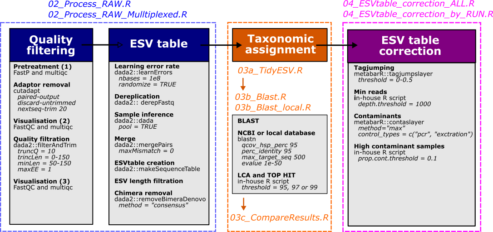

# MLI metabarcoding pipeline

**Current version : 0.2.4**  
Check [this page](https://github.com/GenomicsMLI-DFO/MLI_metabar_pipeline/releases) for previous versions of the pipeline

__Main author:__  Audrey Bourret         
__Affiliation:__  Fisheries and Oceans Canada (DFO)   
__Group:__        Laboratory of genomics   
__Location:__     Maurice Lamontagne Institute, Mont-Joli, Québec, Canada  
__Affiliated publication:__ Chevrinais, M., Bourret, A., Côté, G. et al. 2025a. Improving an endangered marine species distribution using reliable and localized environmental DNA detections combined with trawl captures. Sci Rep 15, 11926. [https://doi.org/10.1038/s41598-025-95358-3](https://www.nature.com/articles/s41598-025-95358-3)       
__Contact:__      e-mail: audrey.bourret@dfo-mpo.gc.ca 

- [Description](#description)
- [Status](#status)
- [How to use the pipeline](#how-to-use-the-pipeline)
  + [Pre-requisite](#pre-requisite)
  + [Before starting an analysis](#before-starting-an-analysis)
  + [Rename raw files](#rename-raw-files)
  + [From raw reads to MOTUs tables](#from-raw-reads-to-motus-table)
  + [Taxonomic assignments](#taxonomic-assignments)
  + [Correct MOTUs tables](#correct-motus-tables)
- [Example](#example)
- [Limitations](#limitations)
- [References](#references)

## Description 

Welcome to the template repository to use the latest version of the MLI metabarcoding pipeline. This pipeline is intended to run in R (and Rstudio) using a few scripts, but needs a few external programs too (see [pre-requisite section](#pre-requisite)). This pipeline can run either on multiple pre-defined loci, or on new ones too.




## Status
Released. 

## How to use the pipeline

### Pre-requisite

The R scripts should be executed line by line within an intregrated development environment (IDE) such as [Rstudio](https://posit.co/download/rstudio-desktop/). Some external programs are also required:
  - [fastqc](https://www.bioinformatics.babraham.ac.uk/projects/fastqc/)
  - [multiqc](https://multiqc.info/)
  - [fastp](https://github.com/OpenGene/fastp)  
  - [cutadapt](https://cutadapt.readthedocs.io/en/stable/)
  - [blast](https://blast.ncbi.nlm.nih.gov/Blast.cgi?CMD=Web&PAGE_TYPE=BlastDocs&DOC_TYPE=Download)

To be sure that the external command is found by R, try to run the test script **01_Code/00_Check_External_Program.R**, or these commands directly:

```{r}
system2("fastqc", "--help")
system2("fastp", "--help")
system2("multiqc", "--help")
system2("cutadapt", "--help")
system2("blastn", "--help")
```

MultiQC and cutadapt can be installed in a python environment that should be added to the R path through the [Option.txt](Option.txt) file, or with this command line:

```{r}
Sys.setenv(PATH = paste(c("/path/to/PythonVenv/bin",
                          Sys.getenv("PATH")),
                          collapse = .Platform$path.sep))
```
### Before starting an analysis

- Press the green button **Use this template** at the top of this page to get your own copy of this pipeline (or download the .zip version through the Code button if your are not familiar with github).
- Put sequencing raw fastq files into the *00_Data/01a_RawData* folder (training files can be found [here](https://github.com/GenomicsMLI-DFO/MLI_metabar_example_dataset))
- Fill the [.csv](00_Data/00_FileInfos/SeqInfo.csv) file within the 00_Data/00_FileInfos folder 
- If necessary, install the depending R packages : `readr`, `tidyr`, `magrittr`,`dplyr`,`stringr`,`here`,`parallel`, `ggplot2`, `ggforce`

This can be done all at once with this command line in R :

```{r}
install.packages(c("readr", "tidyr", "magrittr", "dplyr", "stringr", "here", "parallel", "ggplot2", "ggforce"))
```
Somes packages are from biostrings : `dada2`, `Biostrings`, `biomformat`

```{r}
if (!requireNamespace("BiocManager", quietly = TRUE))
    install.packages("BiocManager")
 
BiocManager::install("Biostrings")
BiocManager::install("dada2")
BiocManager::install("biomformat")
```

Others are available on github : `metabaR`

```{r}
if (!requireNamespace("remotes", quietly = TRUE))
    install.packages("remotes")
remotes::install_github("metabaRfactory/metabaR")
```
 - Check that parameter sets in [Option.txt](Option.txt) corresponds to your analysis (Locus to analyse, N cores available on your machine)
 
 Current loci already set are the following:

| Primer | F | R | Ref |
--- | --- | --- | --- | 
|COI|GGWACWGGWTGAACWGTWTAYCCYCC|TAIACYTCIGGRTGICCRAARAAYCA| Geller et al 2013, Leray et al 2013 |	
|MiFishU|GTCGGTAAAACTCGTGCCAGC|CATAGTGGGGTATCTAATCCCAGTTTG| Miya et al 2015  |	
|12S248|CGTGCCAGCCACCGCGGTT|CATAGTGGGGTATCTAATCCCAGTTTG| He et al 2022|
|12S160| HCGGCGTAAAGVGTGGTTA|CATAGTGGGGTATCTAATCCCAGTTTG| Saunders et al 2024 |
|Dloop-Pv |AGCACCCAAAGCTGACATTC|CGGAGCGAGATCTAGGTACAC | Chevrinais et al 2025b | 

Other loci can be added, but you'll need to set new parameters in *Options.txt*, and *00_Code/Parameters* folder.

### Rename raw files

To be processed, fastq files must be renamed as **SAMPLENAME_MARKER_R1or2.fastq.gz**. This can be done with scripts **01_Renames_RAW_FileName** :

Use **01_Rename_RAW_FileName.R** within *01_Code* folder to rename zipped fastq files on demultiplexed data. It will used the metadata file (*SeqInfo.csv*) to create a new name. File name must exclude the **_R1orR2.fastq.gz** part.

Use **01_Rename_RAW_FileName_Multiplex.R** within *01_Code* folder to rename zipped fastq files on multiplexed data (same sample but at different loci). It will used the metadata file (*SeqInfo.csv*) to create a new name. File name must exclude the **_R1orR2.fastq.gz** part, and should be repeated to all samples multiplexed together. 

### From raw reads to MOTUs tables

Use the file **02_Process_RAW.R** within *01_Code* folder to transform raw reads into an ESV table on demultiplexed data. 

Use the file **02_Process_RAW_Multiplexed.R** within *01_Code* folder to transform raw reads into an ESV table on multiplexed data (same sample but at different loci). 

Six steps are included:
1. fastp and multiQC on raw reads
2. Cutadapt to check for and remove adaptors (followed by a second fastQC/multiQC)
	- The option novaseq TRUE/FALSE allowed to used to option -nextseq-trim=20
3. dada2 filtering (followed by a third fastQC/multiQC)
4. dada2 error rate assessment
5. dada2 dereplication, sample inference and merging
6. dada2 filter ESV based on their expected length
7. dada2 chimera removal

Specific parameters of dada2 step can be modified in the file [*dada2_param.tsv*](./01_Code/Parameters/dada2_param.tsv)

### Taxonomic assignments

Taxonomical assignments are perfomed through multiple complementary scripts. First, use the mandatory script **03a_TaxoAssign_TidyESV.R** within *01_Code* folder to generate the files that are needed in the next steps.

Then, 3 options of assignement are avalaible: 

1. The script **03b_TaxoAssign_Blast.R** within *01_Code* folder performs basic blast assignments using NCBI-nt (Genbank) reference sequences with LCA and Tophit at 95, 97, and 99 thresholds. 

You will need a local version of NCBI-nt database to run this script, and set its path into the [*Options.txt*](./Options.txt) file. Check [here](https://blast.ncbi.nlm.nih.gov/Blast.cgi?CMD=Web&PAGE_TYPE=BlastDocs&DOC_TYPE=Download) for more info.  

Specific parameters of this step can be modified in the file [*blast_param.tsv*](./01_Code/Parameters/blast_param.tsv)

2. The script **03b_TaxoAssign_Blast_local.R** within *01_Code* folder performs blast assignments using local reference sequences with LCA and Tophit at 95, 97, and 99 thresholds. 

You will need a local reference database to run this script, and set its path into the [*Options.txt*](./Options.txt) file.  

Specific parameters of this step can be modified in the file [*blast_param.tsv*](./01_Code/Parameters/blast_param.tsv)

3. The script **03b_TaxoAssign_RDP.R** within *01_Code* folder performs basic RDP assignments using a pre-trained dataset. 

You will need a pre-trained dataset to run this script, and set its path into the [*Options.txt*](./Options.txt) file.  

Specific parameters of this step can be modified in the file [*RDP_param.tsv*](./01_Code/Parameters/rdp_param.tsv)

You can choose to run one or more assignment methods.  

Finally, the script **03c_TaxoAssign_CompareResults.R** within *01_Code* folder needs to be run to create a final taxonomical assignment results that can combine more that one assignment method, which is recommanded (Bourret et al. 2023). The choice of the final assignment methods is also defined in the [*Options.txt*](./Options.txt) file. An option for correction of final taxonomic levels for each taxon by WoRMS nomenclature is given in the script **03c_TaxoAssign_CompareResults_WORMS_corrected.R** within *01_Code* folder.

### Correct MOTUs tables

This step will provide information to identify and correct MOTU tables generated by the pipeline, using the **metabaR** package. Two versions of the script are available:

1. [04_ESVtable_correction_ALL.R](./01_Code/04_ESVtable_correction_ALL.R) to perform the correction over all projects all at once.
2. [04_ESVtable_correction_by_RUN.R](./01_Code/04_ESVtable_correction_by_RUN.R) to perform the correction for a specific RUN (should be run separatly for each RUN). In this case the RUN should be specified at line 45.

This script will generate, for each locus, many figures and summary tables in the **02_Results/04_ESVtable_correction** folder, and corrected outputs in the **00_Data/04_ESVcorrected** folder. To help with the interpretation of the outputs, you can check the [metabar website](https://metabarfactory.github.io/metabaR/articles/metabaRF-vignette.html).  

To run this script, you will need specific columns to be fulfilled in the [*SeqInfo.csv*](./00_Data/00_FileInfos/SeqInfo.csv) file: ID_plate, ID_well, ID_subproject, Sample_type, Run, Index_i7 and Index_I5. 

Specific parameters of this step can be modified in the files [*metabar_param.tsv*](./01_Code/Parameters/metabar_param.tsv) and [*metabar_exclude_taxa.tsv*](./01_Code/Parameters/metabar_exclude_taxa.tsv)

## Example

A test dataset can be downloaded here: https://github.com/GenomicsMLI-DFO/MLI_metabar_example_dataset

Put these files within the **00_Data/01a_Raw_Data** folder.

The data set contains 4 samples at the COI marker, both F (R1) and R (R2).

## Limitations

While entire R scripts can be sent through the command line, sending lines by lines through Rstudio is preferred.

Parameters were tested with PE250 sequencing. They should be adjusted for different read length.

## References

Chevrinais, M., Côté, G., Gingras, G., et al. 2025b. Refining the distribution and confirming the phylogenetic relationship of the endangered landlocked harbour seal _Phoca vitulina mellonae_ using environmental DNA. Canadian Journal of Fisheries and Aquatic Science. In review. 

Chevrinais, M., Bourret, A., Côté, G. et al. 2025a. Improving an endangered marine species distribution using reliable and localized environmental DNA detections combined with trawl captures. Sci Rep 15, 11926. [https://doi.org/10.1038/s41598-025-95358-3](https://www.nature.com/articles/s41598-025-95358-3)  

Bourret, A., Nozères, C., Parent, E., and Parent, G.J. 2023. Maximizing the reliability and the number of species assignments in metabarcoding studies using a curated regional library and a public repository. Metabarcoding and Metagenomics 7: 37–49. [doi:10.3897/mbmg.7.98539](https://mbmg.pensoft.net/article/98539/).

Geller, J., Meyer, C., Parker, M., and Hawk, H. 2013. Redesign of PCR primers for mitochondrial cytochrome c oxidase subunit I for marine invertebrates and application in all‐taxa biotic surveys. Mol. Ecol. Resour. 13(5): 851–861.

He X, Stanley RRE, Rubidge EM, et al (2022) Fish community surveys in eelgrass beds using both eDNA metabarcoding and seining: implications for biodiversity monitoring in the coastal zone. Can J Fish Aquat Sci 79:1335–1346

Leray, M., Yang, J.Y., Meyer, C.P., Mills, S.C., Agudelo, N., Ranwez, V., Boehm, J.T., and Machida, R.J. 2013. A new versatile primer set targeting a short fragment of the mitochondrial COI region for metabarcoding metazoan diversity: application for characterizing coral reef fish gut contents. Front. Zool. 10(1): 1–14.

Miya M, Sato Y, Fukunaga T, et al (2015) MiFish, a set of universal PCR primers for metabarcoding environmental DNA from fishes: detection of more than 230 subtropical marine species. R Soc Open Sci 2:150088. https://doi.org/10.1098/rsos.150088

Saunders M, Steeves R, MacIntyre LP, et al (2024) Monitoring estuarine fish communities – environmental DNA (eDNA) metabarcoding as a complement to beach seining. Can J Fish Aquat Sci e-First: https://doi.org/https://doi.org/10.1139/cjfas-2023-0227


