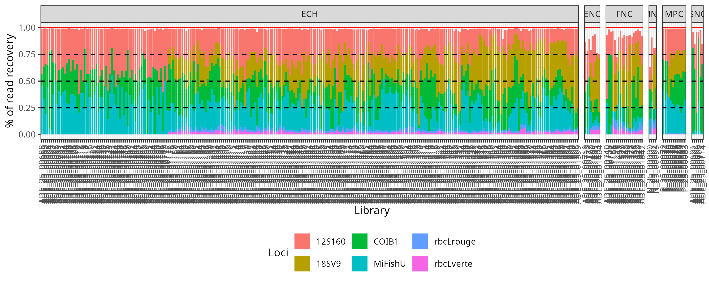
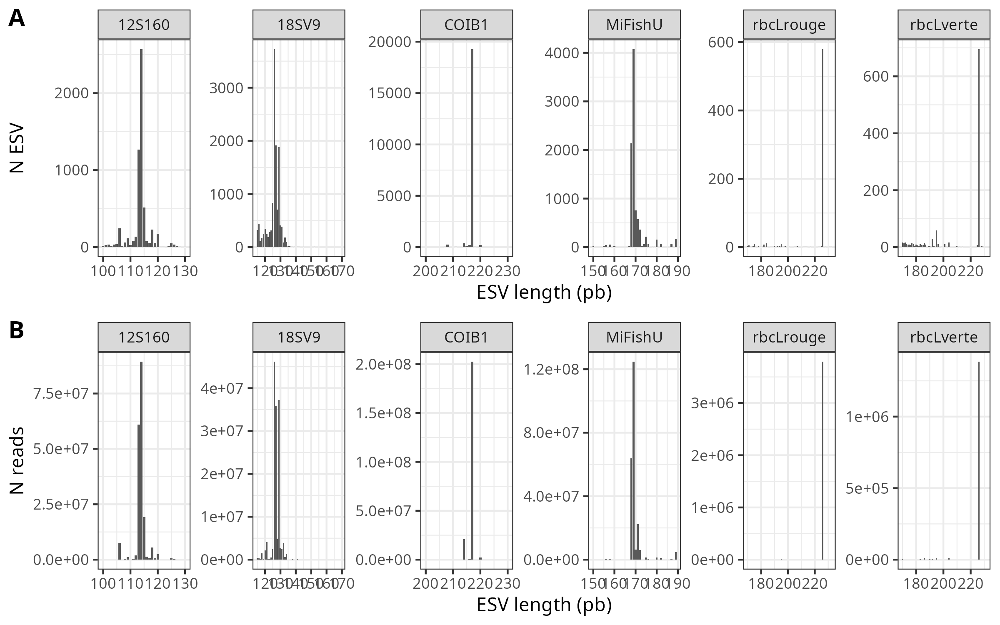

A25_26_Biodiversite3
================

**Main author:** Audrey Bourret  
**Affiliation:** Fisheries and Oceans Canada (DFO)  
**Group:** Laboratory of genomics  
**Location:** Maurice Lamontagne Institute, Mont-Joli, Québec, Canada  
**Affiliated publication:** **Contact:** e-mail:
<audrey.bourret@dfo-mpo.gc.ca>

- [Description](#description)
- [Status](#status)
- [Contents](#contents)
- [Methods](#methods)
- [Supplementary results](#supplementary-results)
- [Requirements](#requirements)

## Description

Repository of an analysis using the MLI metabarcoding pipeline.

**Table 1: Project and loci covered by this repository.**

| ID_subproject           | 12S160 | COIB1 | MiFishU | 18SV9 | rbcLrouge | rbcLverte |
|:------------------------|-------:|------:|--------:|------:|----------:|----------:|
| BDA                     |     44 |    44 |      44 |    NA |        NA |        NA |
| Biodiversite_Parc_Marin |     33 |    33 |      33 |    NA |        NA |        NA |
| Twells_Innu_Nation_2024 |    130 |   130 |     130 |   130 |       130 |       130 |
| Twells_Innu_Nation_2025 |     96 |    96 |      96 |    96 |        96 |        96 |

## Status

Ongoing-improvements

## Contents

### Folder structure

    .
    ├── OO_Data     # Folder containing data used for the analyses, and final files (ESVtable, MOTUs infos) 
    ├── 01_Code     # R scripts  
    ├── 02_Results  # Main results
    ├── 03_Rapport  # Automatic reports and associated datasets
    └── README.md

### List of reports produced

These reports are within the **03_Rapport** folder:

    ## character(0)

## Methods

## Supplementary results

|  |
|:-----------------------------------------------------------------:|
|     **Figure 1** Proportion of reads recovered for each loci.     |

|  |
|:----------------------------------------------------:|
|       **Figure 2** Pre-filtration ESV length.        |

## Requirements

Analysis were run on a server, and large files should be temporary find
at **/media/genyoda/Storage/Projets/A25_26_Biodiversite3_metabar** prior
to moving on a permanent location on the NAS.

*This github readme was generated by knitting the README.Rmd from
Rstudio.*
